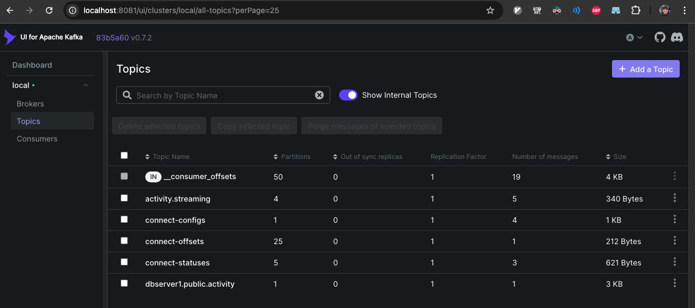

# Exercise2 Ranzmaier
# Activity 1 

Start the Exercise2 services.

```shell
$ docker compose up -d
 ...
 Container postgres  Started
 Container kafka  Started
 Container connect  Started
 Container kafka-ui  Started
```

Verify containers are running.

```shell
$ docker ps --format "table {{.ID}}\t{{.Image}}\t{{.Status}}\t{{.Ports}}\t{{.Names}}" --filter name=postgres --filter name=kafka --filter name=kafka-ui --filter name=connect
CONTAINER ID   IMAGE                           STATUS                    PORTS                                                                                      NAMES
3f553ebde607   debezium/connect:2.7.2.Final    Up 18 seconds             0.0.0.0:8083->8083/tcp, [::]:8083->8083/tcp                                                connect
1e367190df76   provectuslabs/kafka-ui:latest   Up 18 seconds             0.0.0.0:8081->8080/tcp, [::]:8081->8080/tcp                                                kafka-ui
9da35748394d   postgres:18.1                   Up 18 seconds (healthy)   0.0.0.0:5433->5432/tcp, [::]:5433->5432/tcp                                                postgres
6fde66b277a6   bitnamilegacy/kafka:latest      Up 18 seconds             0.0.0.0:9092->9092/tcp, [::]:9092->9092/tcp, 0.0.0.0:9094->9094/tcp, [::]:9094->9094/tcp   kafka
```

Verify Kafka UI responds on localhost.

```shell
$ curl -s -o /dev/null -w "%{http_code}\n" http://localhost:8081
200
```

Verify PostgreSQL is reachable.

```shell
$ docker exec -i postgres psql -U postgres -c "SELECT version();"
                                                         version                                                          
--------------------------------------------------------------------------------------------------------------------------
 PostgreSQL 18.1 (Debian 18.1-1.pgdg13+2) on aarch64-unknown-linux-gnu, compiled by gcc (Debian 14.2.0-19) 14.2.0, 64-bit
(1 row)
```

Create the Kafka topic with 4 partitions.

```shell
$ docker exec -i kafka kafka-topics.sh --bootstrap-server localhost:9092 --create --topic activity.streaming --partitions 4 --replication-factor 1
WARNING: Due to limitations in metric names, topics with a period ('.') or underscore ('_') could collide. To avoid issues it is best to use either, but not both.
Created topic activity.streaming.
```

List topics.

```shell
$ docker exec -i kafka kafka-topics.sh --bootstrap-server localhost:9092 --list
__consumer_offsets
activity.streaming
connect-configs
connect-offsets
connect-statuses
```

Describe the topic.

```shell
$ docker exec -i kafka kafka-topics.sh --bootstrap-server localhost:9092 --describe --topic activity.streaming
Topic: activity.streaming	TopicId: wEAdyBo7QvmFhuaCmMJjhA	PartitionCount: 4	ReplicationFactor: 1	Configs: segment.bytes=1073741824
Topic: activity.streaming	Partition: 0	Leader: 1	Replicas: 1	Isr: 1	Elr: 	LastKnownElr: 
Topic: activity.streaming	Partition: 1	Leader: 1	Replicas: 1	Isr: 1	Elr: 	LastKnownElr: 
Topic: activity.streaming	Partition: 2	Leader: 1	Replicas: 1	Isr: 1	Elr: 	LastKnownElr: 
Topic: activity.streaming	Partition: 3	Leader: 1	Replicas: 1	Isr: 1	Elr: 	LastKnownElr: 
```

Show topic configs.

```shell
$ docker exec -i kafka kafka-configs.sh --bootstrap-server localhost:9092 --entity-type topics --entity-name activity.streaming --describe
Dynamic configs for topic activity.streaming are:
```

Produce messages without keys. Piped from printf.

```shell
$ printf '{"id":1,"name":"Alice"}\n{"id":2,"name":"Bob"}\n' | docker exec -i kafka kafka-console-producer.sh --bootstrap-server localhost:9092 --topic activity.streaming
```

Produce messages with keys.

```shell
$ printf '1:{"id":1,"name":"Alice"}\n1:{"id":1,"name":"Alice-updated"}\n2:{"id":2,"name":"Bob"}\n' | docker exec -i kafka kafka-console-producer.sh --bootstrap-server localhost:9092 --topic activity.streaming --property parse.key=true --property key.separator=:
```

Consume from the beginning.

```shell
$ docker exec -i kafka kafka-console-consumer.sh --bootstrap-server localhost:9092 --topic activity.streaming --from-beginning --max-messages 5
{"id":1,"name":"Alice"}
{"id":1,"name":"Alice-updated"}
{"id":1,"name":"Alice"}
{"id":2,"name":"Bob"}
{"id":2,"name":"Bob"}
Processed a total of 5 messages
```

Consume using a consumer group.

```shell
$ docker exec -i kafka kafka-console-consumer.sh --bootstrap-server localhost:9092 --topic activity.streaming --group customers-service --from-beginning --max-messages 3
{"id":1,"name":"Alice"}
{"id":1,"name":"Alice-updated"}
{"id":1,"name":"Alice"}
Processed a total of 3 messages
```

Inspect consumer group offsets.

```shell
$ docker exec -i kafka kafka-consumer-groups.sh --bootstrap-server localhost:9092 --describe --group customers-service

Consumer group 'customers-service' has no active members.

GROUP             TOPIC              PARTITION  CURRENT-OFFSET  LOG-END-OFFSET  LAG             CONSUMER-ID     HOST            CLIENT-ID
customers-service activity.streaming 3          2               2               0               -               -               -
customers-service activity.streaming 1          1               2               1               -               -               -
customers-service activity.streaming 2          0               0               0               -               -               -
customers-service activity.streaming 0          0               1               1               -               -               -
```

Verify Kafka Connect plugins (Debezium).

```shell
$ curl -s http://localhost:8083/connector-plugins | jq '.[0:3]'
[
  {
    "class": "io.debezium.connector.jdbc.JdbcSinkConnector",
    "type": "sink",
    "version": "2.7.2.Final"
  },
  {
    "class": "io.debezium.connector.db2.Db2Connector",
    "type": "source",
    "version": "2.7.2.Final"
  },
  {
    "class": "io.debezium.connector.db2as400.As400RpcConnector",
    "type": "source",
    "version": "2.7.2.Final"
  }
]
```

Create the activity database and table.

```shell
$ docker exec -i postgres psql -U postgres -c "CREATE DATABASE activity;"
CREATE DATABASE

$ docker exec -i postgres psql -U postgres -d activity -c "SELECT current_database();"
 current_database 
------------------
 activity
(1 row)

$ docker exec -i postgres psql -U postgres -d activity -c "CREATE TABLE activity (id SERIAL PRIMARY KEY, name VARCHAR(255) NOT NULL, email VARCHAR(255));"
CREATE TABLE
```

Register the Debezium connector.

```shell
$ curl -sS -i -X POST -H "Accept:application/json" -H "Content-Type:application/json" localhost:8083/connectors/ -d '{
  "name": "activity-connector",
  "config": {
    "connector.class": "io.debezium.connector.postgresql.PostgresConnector",
    "tasks.max": "1",
    "database.hostname": "postgres",
    "database.port": "5432",
    "database.user": "postgres",
    "database.password": "postgrespw",
    "database.dbname": "activity",
    "slot.name": "activityslot",
    "topic.prefix": "dbserver1",
    "plugin.name": "pgoutput",
    "database.replication.slot.name": "debeziumactivity"
  }
}'
HTTP/1.1 201 Created
Date: Tue, 13 Jan 2026 09:39:22 GMT
Location: http://localhost:8083/connectors/activity-connector
Content-Type: application/json
Content-Length: 456
Server: Jetty(9.4.53.v20231009)

{"name":"activity-connector","config":{"connector.class":"io.debezium.connector.postgresql.PostgresConnector","tasks.max":"1","database.hostname":"postgres","database.port":"5432","database.user":"postgres","database.password":"postgrespw","database.dbname":"activity","slot.name":"activityslot","topic.prefix":"dbserver1","plugin.name":"pgoutput","database.replication.slot.name":"debeziumactivity","name":"activity-connector"},"tasks":[],"type":"source"}
```

Check Debezium connector status.

```shell
$ curl -s http://localhost:8083/connectors/activity-connector/status | jq
{
  "name": "activity-connector",
  "connector": {
    "state": "RUNNING",
    "worker_id": "172.20.0.4:8083"
  },
  "tasks": [
    {
      "id": 0,
      "state": "RUNNING",
      "worker_id": "172.20.0.4:8083"
    }
  ],
  "type": "source"
}
```

Insert a record into PostgreSQL.

```shell
$ docker exec -i postgres psql -U postgres -d activity -c "INSERT INTO activity(id, name) VALUES (1, 'Alice');"
INSERT 0 1
```

Consume the Debezium CDC topic.

```shell
$ docker exec -i kafka kafka-console-consumer.sh --bootstrap-server localhost:9092 --topic dbserver1.public.activity --from-beginning --max-messages 1
{"schema":{"type":"struct","fields":[{"type":"struct","fields":[{"type":"int32","optional":false,"default":0,"field":"id"},{"type":"string","optional":false,"field":"name"},{"type":"string","optional":true,"field":"email"}],"optional":true,"name":"dbserver1.public.activity.Value","field":"before"},{"type":"struct","fields":[{"type":"int32","optional":false,"default":0,"field":"id"},{"type":"string","optional":false,"field":"name"},{"type":"string","optional":true,"field":"email"}],"optional":true,"name":"dbserver1.public.activity.Value","field":"after"},{"type":"struct","fields":[{"type":"string","optional":false,"field":"version"},{"type":"string","optional":false,"field":"connector"},{"type":"string","optional":false,"field":"name"},{"type":"int64","optional":false,"field":"ts_ms"},{"type":"string","optional":true,"name":"io.debezium.data.Enum","version":1,"parameters":{"allowed":"true,last,false,incremental"},"default":"false","field":"snapshot"},{"type":"string","optional":false,"field":"db"},{"type":"string","optional":true,"field":"sequence"},{"type":"int64","optional":true,"field":"ts_us"},{"type":"int64","optional":true,"field":"ts_ns"},{"type":"string","optional":false,"field":"schema"},{"type":"string","optional":false,"field":"table"},{"type":"int64","optional":true,"field":"txId"},{"type":"int64","optional":true,"field":"lsn"},{"type":"int64","optional":true,"field":"xmin"}],"optional":false,"name":"io.debezium.connector.postgresql.Source","field":"source"},{"type":"struct","fields":[{"type":"string","optional":false,"field":"id"},{"type":"int64","optional":false,"field":"total_order"},{"type":"int64","optional":false,"field":"data_collection_order"}],"optional":true,"name":"event.block","version":1,"field":"transaction"},{"type":"string","optional":false,"field":"op"},{"type":"int64","optional":true,"field":"ts_ms"},{"type":"int64","optional":true,"field":"ts_us"},{"type":"int64","optional":true,"field":"ts_ns"}],"optional":false,"name":"dbserver1.public.activity.Envelope","version":2},"payload":{"before":null,"after":{"id":1,"name":"Alice","email":null},"source":{"version":"2.7.2.Final","connector":"postgresql","name":"dbserver1","ts_ms":1768297171829,"snapshot":"false","db":"activity","sequence":"[null,\"33837424\"]","ts_us":1768297171829031,"ts_ns":1768297171829031000,"schema":"public","table":"activity","txId":769,"lsn":33837424,"xmin":null},"transaction":null,"op":"c","ts_ms":1768297172142,"ts_us":1768297172142541,"ts_ns":1768297172142541672}}
Processed a total of 1 messages
```



# Debezium CDC with PostgreSQL and Kafka

This setup listens to changes in PostgreSQL and streams them into Kafka topics as soon as it notices the change. Debezium reads the postgres log and turns each insert/update/delete into an event, so the database becomes the real-time source of truth.

I think its very relevant AI because changes move immediately, not in batches. That keeps features, dashboards, and monitoring close to real-time and lets many services consume the same events without polling the database.

Good use cases may be event-driven pipelines, real-time analytics, and anomaly detection.
The drawback is the added operational complexity of running Kafka and Debezium alongside the database. Also, there may be latency and ordering issues in high-throughput scenarios but overall the database accesses patterns are simplified and decoupled from consumers.
