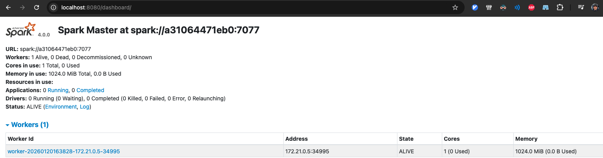
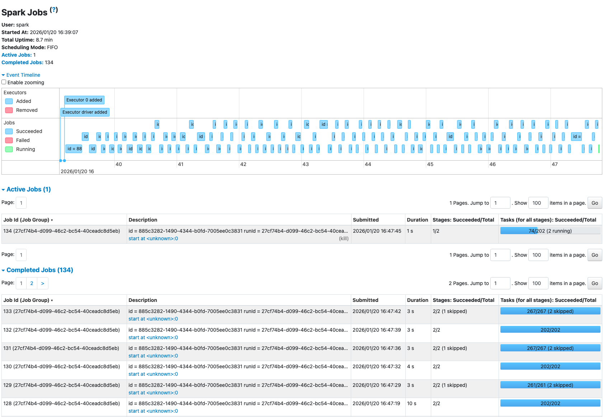
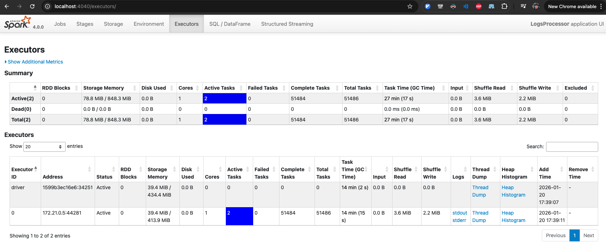
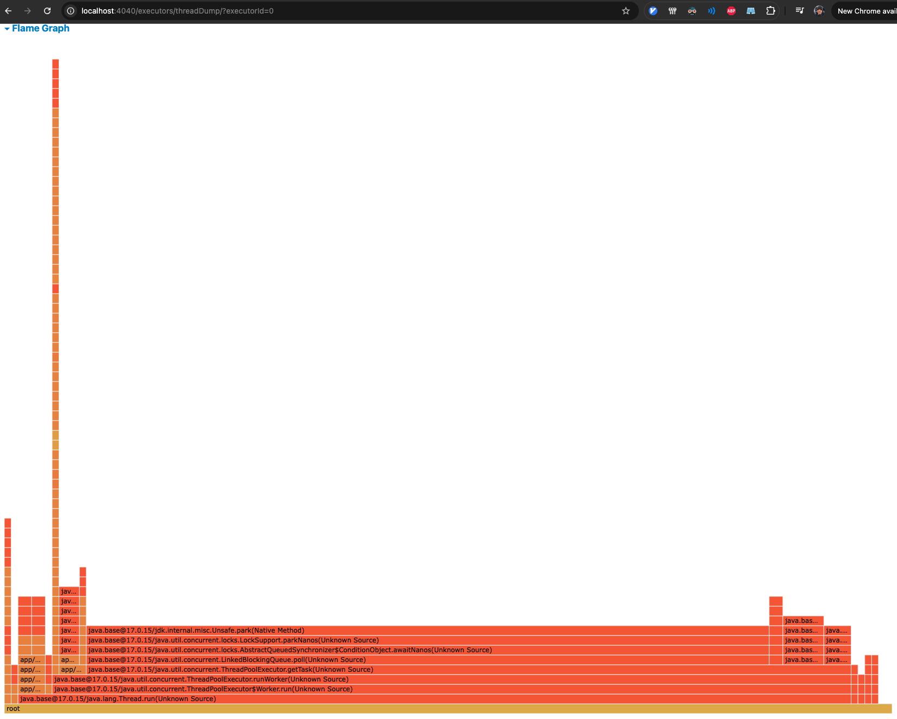
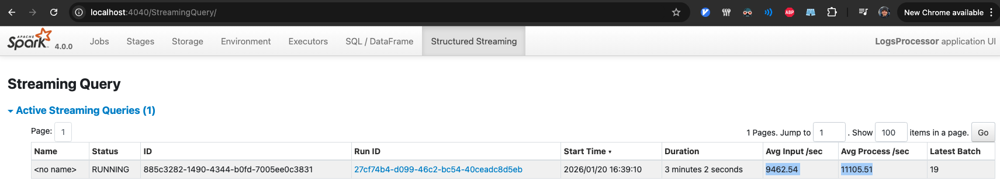

# Exercise3 Ranzmaier

## Overall workflow discussion
The workflow follows `Exercise3/logs-processing/Instructions.md`: start the stack with Docker, create the Kafka topic, start the log generator, run the Spark Structured Streaming job inside `spark-client`, and observe execution in the Spark UI.

# Activity 1 - Understanding the execution of Spark applications

Keep a single worker and run long enough to capture the UI.

The Spark driver runs inside the `spark-client` container and submits the job to `spark-master`. Kafka provides the `logs` topic with two partitions so the read stage can parallelize. The job filters and aggregates, causing a shuffle in the groupBy stage. We verify the job wiring (Kafka, Spark UI, executors) and inspect the DAG and stages in the UI.

### Step 1 - Start core services (Kafka + Spark)
From `Exercise3`:
```shell-session
$ docker compose up -d
```

### Step 2 - Verify the Spark Master UI
- Spark Master: http://localhost:8080

### Step 3 - Create the Kafka topic for logs
```shell-session
$ docker exec -it kafka kafka-topics.sh \
  --bootstrap-server localhost:9092 \
  --create \
  --topic logs \
  --partitions 2 \
  --replication-factor 1
```

### Step 4 - Start the load generator (single instance)
From `Exercise3/logs-processing/load-generator`:
```shell-session
$ docker compose up -d
```

### Step 5 - Run the baseline Spark Structured Streaming job (single worker)
```shell-session
$ docker exec -it spark-client spark-submit \
  --master spark://spark-master:7077 \
  --packages org.apache.spark:spark-sql-kafka-0-10_2.13:4.0.0 \
  --num-executors 1 \
  --executor-cores 1 \
  --executor-memory 1G \
  /opt/spark-apps/spark_structured_streaming_logs_processing.py
```
Spark runs inside the container; attaching VS Code to `spark-client` is an equivalent way to run `spark-submit`.

### Step 6 - UI checkpoints (evidence)
dashboard: http://localhost:8080/dashboard

Spark Master UI (dashboard, workers, and running application):
one worker active, 1 core, 1024 MiB memory allocated



### Key Concepts to Observe (Activity 1)
#### A. The Jobs tab and DAG visualization

Spark Driver UI: http://localhost:4040

Jobs tab (three jobs, all successful):


Jobs tab (DAG visualization for the streaming batch):
two stages, with shuffle in read and write


#### B. The Stages tab
The aggregation stage shows shuffle read/write and has the longest duration, which makes it the bottleneck in this run.

#### C. The Executors tab
Executors tab (executor metrics and memory usage):
two running (driver + one executor). About 80 MiB used out of 870 MiB after ~8 minutes.


Executors tab (thread dump for active executor):


### Monitoring (Structured Streaming)
Structured Streaming tab (input vs process rate):
after ~3 minutes the average input per second matched the average process per second around 10,000 records/sec
(9462 input / 11105 process)


Structured Streaming tab (query statistics):
this setup stabilizes fast and keeps up with the input rate.


### 3. Practical exploration questions (Activity 1)
1. The bottleneck is the aggregation shuffle stage, which has the longest duration in the Stages tab.
2. Resource usage is low in the single-worker run (~80 MiB used out of ~850 MiB on the executor).
3. Performance and scalability depend on parallelism (Kafka partitions, executors, and cores / memory allocated) as well as the shuffle costs from groupBy.

# Activity 2 - Tuning for high throughput
Activity 2 targets several hundred thousand events/sec and micro-batches under 20 seconds. On this laptop (8 CPU limit, 15 GB RAM for Docker), the best sustained configuration stayed stable around ~116k events/sec; higher input rates caused backlog growth and longer batch times.

### Step 1 - Scale Spark workers (use available CPU/RAM)
Edit `Exercise3/docker-compose.yaml` and set:
- `SPARK_WORKER_CORES=4`
- `SPARK_WORKER_MEMORY=4G`

Then scale to two workers:
```shell-session
$ docker compose up -d --scale spark-worker=2
```

### Step 2 - Increase Kafka partitions and generator throughput
Recreate the topic with more partitions:
```shell-session
$ docker exec -it kafka kafka-topics.sh \
  --bootstrap-server localhost:9092 \
  --delete \
  --topic logs
$ docker exec -it kafka kafka-topics.sh \
  --bootstrap-server localhost:9092 \
  --create \
  --topic logs \
  --partitions 24 \
  --replication-factor 1
```

In `Exercise3/logs-processing/load-generator/docker-compose.yaml`, set:
- `TARGET_RPS=75000`

Then run two generator instances:
```shell-session
$ docker compose up -d --scale generator=2
```

### Step 3 - Run the tuned Spark job (balanced cores + shuffle parallelism)
```shell-session
$ docker exec -it spark-client spark-submit \
  --master spark://spark-master:7077 \
  --packages org.apache.spark:spark-sql-kafka-0-10_2.13:4.0.0 \
  --num-executors 2 \
  --executor-cores 4 \
  --executor-memory 3G \
  --conf spark.sql.shuffle.partitions=24 \
  /opt/spark-apps/spark_structured_streaming_logs_processing.py
```

### Step 4 - Results (best sustained run)
- Structured Streaming tab: avg input/sec **116,439.95**, avg process/sec **119,235.27** (process >= input).
- Batch durations stabilized after the initial catch-up batch.
Attempts above this rate caused avg input/sec to exceed process/sec and batch durations to increase.

### Step 5 - Verification points in the UI
- Executors tab shows two executors (one per worker) with 4 cores each.
- Executors tab evidence: ~1.6 GiB memory per executor and task counts around ~1.3k on each executor.
- Structured Streaming tab shows input rate vs process rate while the generator is running.
- SQL/Queries DAG shows the shuffle boundary introduced by the groupBy aggregation.

### Bottleneck when scaling the generator
The aggregation shuffle stage remains the limiting step at higher input rates. The Stages tab shows the longest duration for the groupBy stage, and the Structured Streaming tab shows input rate approaching or exceeding process rate as batch duration increases.

# Cleanup
Stop the streaming job by pressing Ctrl+C in the terminal running `spark-submit`.

Run cleanup in both locations as required by the instructions:
Delete the Kafka topic from `Exercise3`:
```shell-session
$ docker exec -it kafka kafka-topics.sh \
  --bootstrap-server localhost:9092 \
  --delete \
  --topic logs
```
From `Exercise3`:
```shell-session
$ docker compose down -v
```
From `Exercise3/logs-processing/load-generator`:
```shell-session
$ docker compose down -v
```
